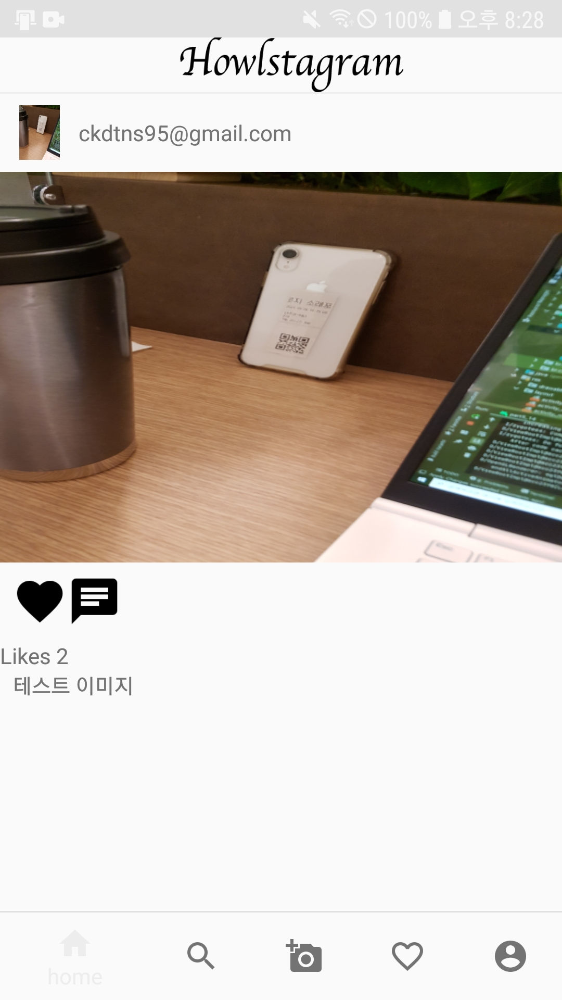
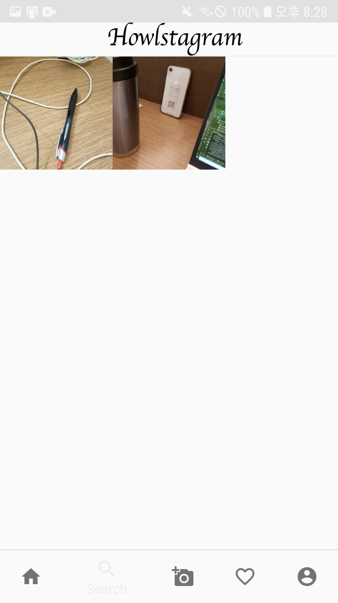
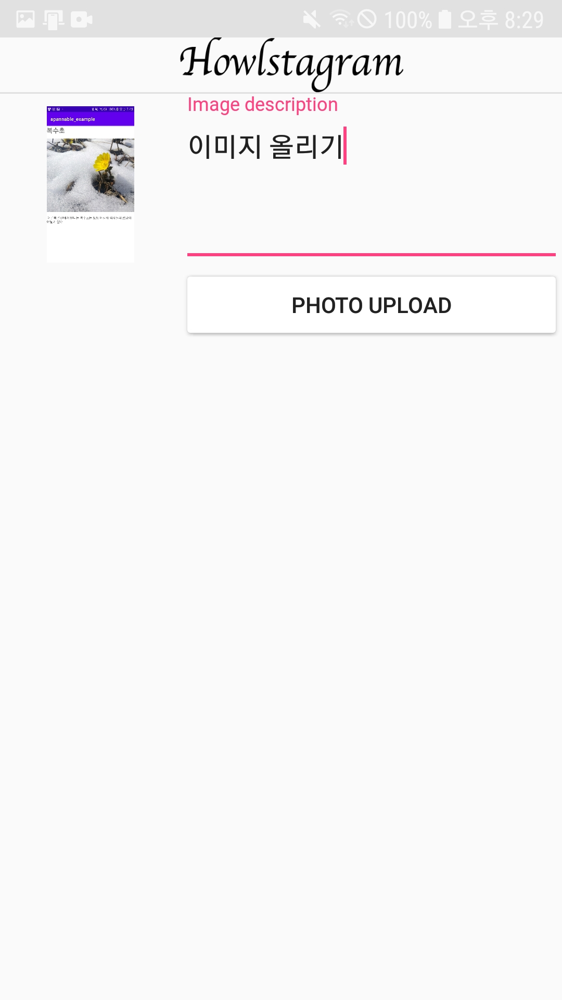
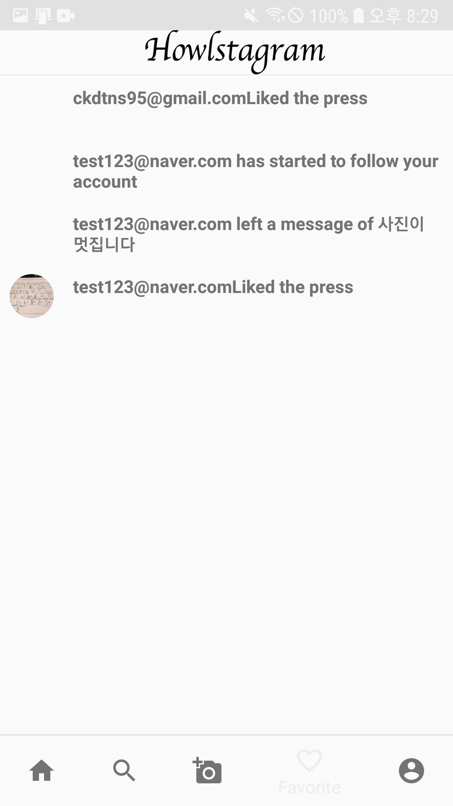
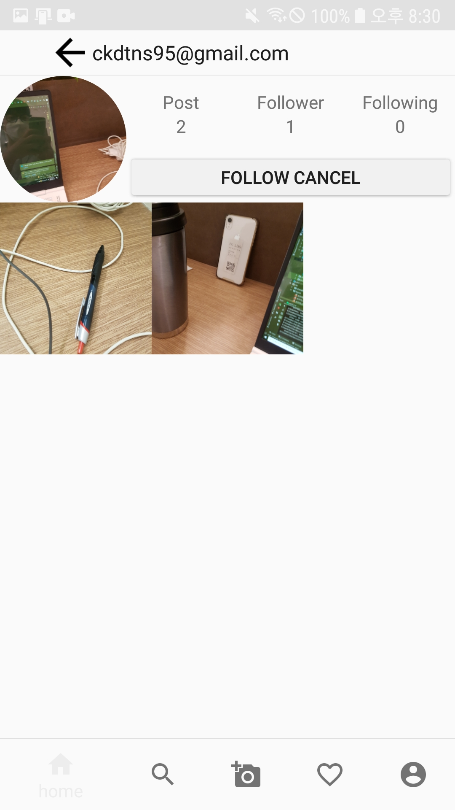

# 서비스 소개

해당 앱은 인스타그램 클론 앱으로 Google Firebase를 사용하여 구현했습니다. 앱의 주요 기능으로는 Firebase의 OAuth를 사용해서 구글과 페이스북 아이디를 통한 로그인을 구현하였고, Firebase Database와 Storage를 사용하여 여러 정보와 이미지를 저장하였습니다. 현재는 안드로이드의 여러 라이브러리와 함께 코틀린을 사용하여 MVVM 패턴으로 앱을 리팩토링하고 있습니다.

 

# 앱 스크린샷

&ensp;

 

&ensp;

 

# 사용 라이브러리

* [Firebase](https://firebase.google.com/docs/auth/)
* [Glide](https://github.com/bumptech/glide)
* [Gson](https://github.com/google/gson)
* [okhttp](https://square.github.io/okhttp/)

 

# 주요 기능

* Firebase Authentication을 통해 로그인을 구현하였습니다.
* Firebase Database를 사용하여 데이터베이스를 관리하였습니다.
* Firebase Storage를 사용하여 이미지를 관리하였습니다.
* Glide를 사용하여 이미지를 로드하였습니다.

 

# 추가할 기능

* Kotlin 코드로 변경 및 MVVM 패턴을 적용하여 리팩토링 하려고 합니다.